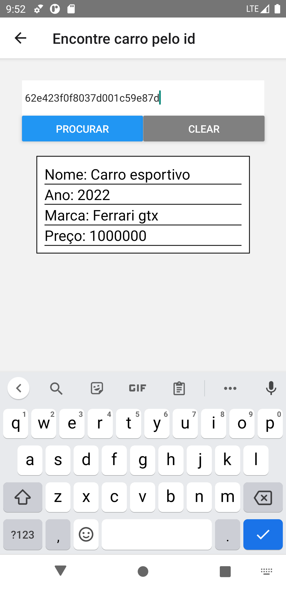
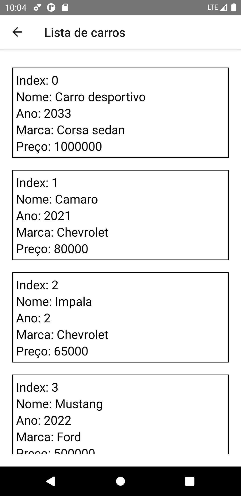
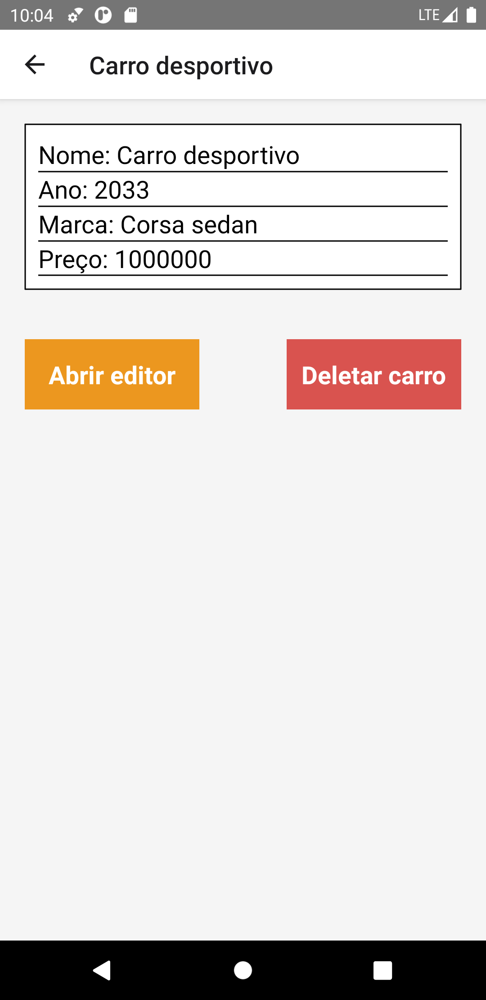
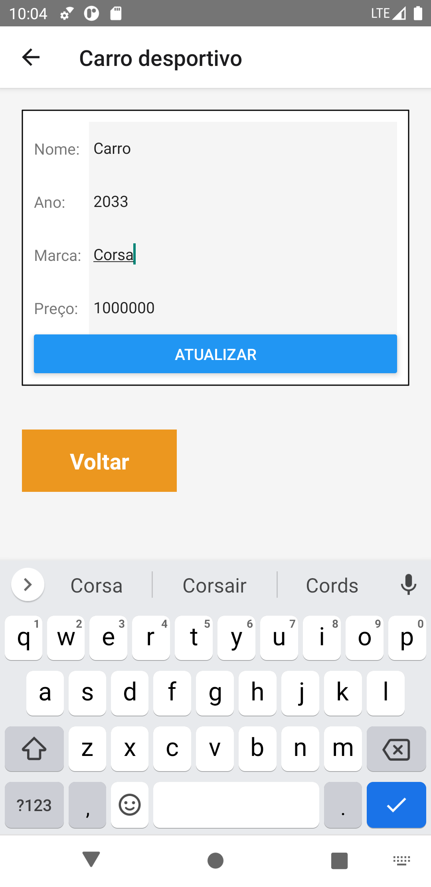
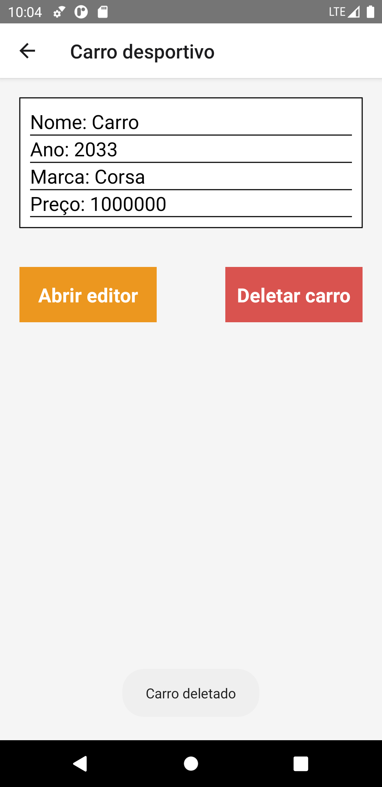
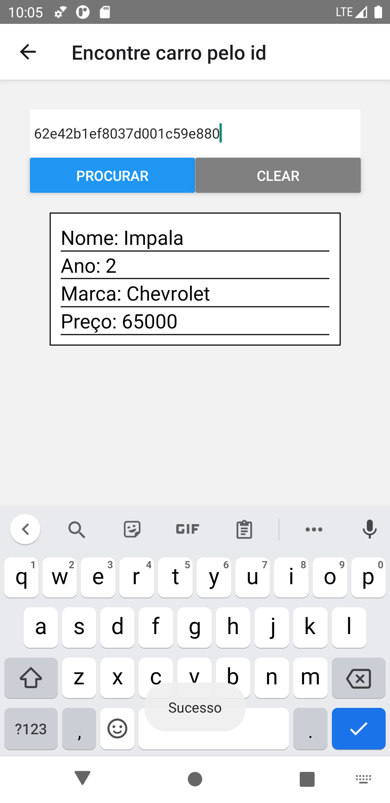
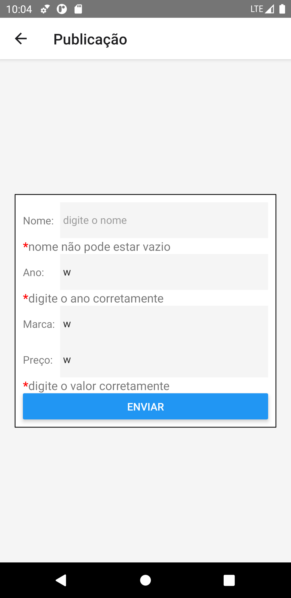

# test_bhut

Projeto feito com react native, typescript, axios e formik para validação dos valores e lidar com formularios e errors  

O objetivo do teste era lidar com os dados da api, não padronização das pastas, clean code, organização etc  
Fiz o minimo ligado ao UX | UI, o foco era lidar com os dados, pegar, deletar, atualizar, postar  

Features: 

busca 
buscar por id  
otimização da flatlist  
dashboard com opção de abrir um editor para alterar os valores e atualizar e deletar  
display de mensagem com ToastAndroid, com sucesso ou fracasso da requisição 
se os valores não forem validos na atualização ou publicação recebe uma mensagem de error 
 

Para rodar o projeto basta clonar a pasta e npm install ou yarn install 

 
 

  

  
  
  
  
   
   

