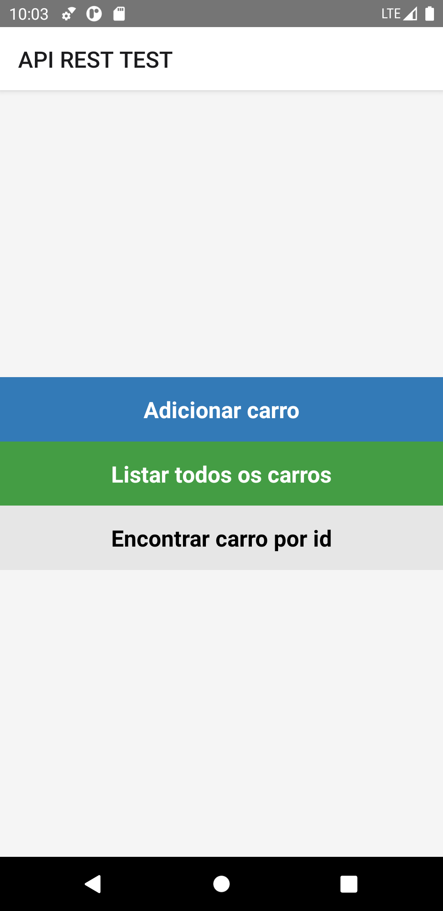

# test_bhut

Projeto feito com react native e typescript e formik para validação dos valores e lidar com formularios e errors 

O objetivo do teste era lidar com os dados da api, não padronização das pastas, clean code, organização etc 
Fiz o minimo ligado a beleza da UI, o foco era lidar com os dados, pegar, deletar, atualizar, postar 

Features:

busca
buscar por id  
otimização da flatlist  
dashboard com opção de abrir um editor para alterar os valores e atualizar e deletar  
display de mensagem com ToastAndroid, com sucesso ou fracasso da requisição
 
 

 
 

  

  
  
  
  
   
   

